# Frobenius-Legendre SLAM POC (Impact Project v1)

**Compositional inference for dynamic SLAM using information-geometric methods**

---
Embracing uncertainty is a cornerstone of robust robotics and SLAM systems, as pursuing absolute certainty often leads to brittle designs that fail under real-world conflicts and unknowns. Fundamental limits like the Heisenberg uncertainty principle highlight inherent trade-offs in measurement precision, while Gödel's incompleteness theorems remind us that no formal model can be fully complete or self-proving, ensuring "certainty" remains illusory. Instead, wise engineering accepts these realities, building antifragile systems that quantify uncertainty (e.g., via covariances and divergences), detect anomalies, and adapt dynamically—turning potential weaknesses into strengths for resilient performance in noisy, dynamic environments.

In practice, this means layering defenses in SLAM: Use principled tools like Wishart conjugates for adaptive noise modeling, Hellinger bounds for outlier rejection, and Frobenius corrections for handling approximations, allowing systems to thrive amid conflicting data rather than assuming monotonic progress or perfect models.
---

## MVP Status

The current **MVP (Minimum Viable Product)** focuses on the **M3DGR Dynamic01 rosbag** evaluation pipeline. This is the smallest reproducible case for validating the FL-SLAM algorithm.

**MVP Components:**
- M3DGR rosbag processing (Livox LiDAR + IMU + RGB-D)
- Frontend: sensor association, ICP loop detection, anchor management, IMU preintegration
- Backend: information-geometric fusion, trajectory estimation (6DOF/15DOF state)
- Evaluation: ATE/RPE metrics and publication-quality plots

**Current Priorities:** See [`ROADMAP.md`](ROADMAP.md) for:
- Priority 1: IMU integration + 15D state extension, wheel odom separation, dense RGB-D in 3D mode
- Priority 2-4: Alternative datasets, GPU acceleration, research features

---

## Quick Start (MVP)

### Build
```bash
cd fl_ws
source /opt/ros/jazzy/setup.bash
colcon build --packages-select fl_slam_poc
source install/setup.bash
```

### Run MVP Pipeline
```bash
# Full pipeline: SLAM + metrics + plots
bash tools/run_and_evaluate.sh
```

This runs the M3DGR Dynamic01 rosbag through the complete SLAM pipeline and generates evaluation metrics/plots in `results/m3dgr_YYYYMMDD_HHMMSS/`.

---

## System Architecture

### M3DGR Rosbag Pipeline

The following diagram illustrates the complete data flow for the M3DGR rosbag evaluation pipeline:

```mermaid
graph TB
    subgraph "Rosbag Topics - M3DGR (Inputs)"
        ODOM["/odom<br/>(nav_msgs/Odometry)<br/>absolute pose"]
        LIVOX["/livox/mid360/lidar<br/>(Livox CustomMsg)"]
        IMU["/camera/imu<br/>(sensor_msgs/Imu)"]
        RGB_COMPRESSED["/camera/color/image_raw/compressed"]
        DEPTH_COMPRESSED["/camera/aligned_depth_to_color/image_raw/compressedDepth"]
    end

    subgraph "Preprocessors - frontend/"
        ODOM_BRIDGE["tb3_odom_bridge.py<br/>absolute → delta pose"]
        LIVOX_CONV["livox_converter.py<br/>Livox → PointCloud2"]
        IMG_DECOMP_CPP["image_decompress_cpp<br/>(C++)"]
    end

    subgraph "Shared - common/"
        SE3["se3.py<br/>SE(3) transforms"]
        DIRICHLET["dirichlet_geom.py<br/>Dirichlet geometry"]
    end

    subgraph "Frontend Node - frontend/"
        FRONTEND["frontend_node.py<br/>(orchestration)"]
        SENSOR_IO["sensor_io.py<br/>(buffers + TF)"]
        ANCHOR_MGR["anchor_manager.py<br/>anchor lifecycle"]
        LOOP_PROC["loop_processor.py<br/>loop detection"]
        ICP_GPU["pointcloud_gpu.py<br/>(GPU ICP)"]
        ICP_CPU["icp.py<br/>(CPU ICP)"]
        DESCRIPTOR["descriptor_builder.py<br/>NIG descriptors"]
    end

    subgraph "Backend Node - backend/"
        BACKEND["backend_node.py<br/>(orchestration)"]
        GAUSSIAN_INFO["gaussian_info.py<br/>(state fusion)"]
        IMU_KERNEL["imu_jax_kernel.py<br/>(JAX/GPU)"]
        DIRICHLET_ROUTING["dirichlet_routing.py"]
        LIE_JAX["lie_jax.py<br/>(JAX/GPU)"]
    end

    subgraph "Outputs"
        STATE["/cdwm/state<br/>Estimated state"]
        TRAJ["/cdwm/trajectory<br/>Trajectory path"]
        MAP["/cdwm/map<br/>Point cloud map"]
    end

    ODOM --> ODOM_BRIDGE
    LIVOX --> LIVOX_CONV
    RGB_COMPRESSED --> IMG_DECOMP_CPP
    DEPTH_COMPRESSED --> IMG_DECOMP_CPP

    ODOM_BRIDGE -->|"/sim/odom<br/>(delta pose)"| FRONTEND
    ODOM_BRIDGE -->|"/sim/odom<br/>(delta pose)"| BACKEND
    LIVOX_CONV -->|"/lidar/points<br/>(PointCloud2)"| FRONTEND
    IMU -->|"/camera/imu"| FRONTEND

    FRONTEND --> SENSOR_IO
    SENSOR_IO --> ANCHOR_MGR
    SENSOR_IO --> LOOP_PROC
    LOOP_PROC --> ICP_GPU
    LOOP_PROC --> ICP_CPU
    ANCHOR_MGR --> DESCRIPTOR

    FRONTEND -->|"/sim/anchor_create<br/>(AnchorCreate.msg)"| BACKEND
    FRONTEND -->|"/sim/loop_factor<br/>(LoopFactor.msg)"| BACKEND
    FRONTEND -->|"/sim/imu_segment<br/>(IMUSegment.msg)"| BACKEND

    BACKEND --> GAUSSIAN_INFO
    BACKEND --> IMU_KERNEL
    BACKEND --> DIRICHLET_ROUTING
    IMU_KERNEL --> LIE_JAX

    DIRICHLET -.->|"imports"| DIRICHLET_ROUTING

    BACKEND --> STATE
    BACKEND --> TRAJ
    BACKEND --> MAP

    style RGB_DISABLED fill:#ffcccc,stroke:#ff0000
    style DEPTH_DISABLED fill:#ffcccc,stroke:#ff0000
    style IMG_DECOMP fill:#ffcccc,stroke:#ff0000
```



### Component Summary

**Rosbag Topics (M3DGR):**
- `/odom` - Absolute pose odometry (`nav_msgs/Odometry`)
- `/livox/mid360/lidar` - Livox LiDAR data (`Livox CustomMsg`)
- `/camera/imu` - IMU data (`sensor_msgs/Imu`)
- Camera topics (RGB/Depth) - Present in bag as compressed; decompressed by `image_decompress_cpp` (usage still controlled by frontend flags)

**Preprocessors (`frontend/`):**
- `tb3_odom_bridge.py` - Converts absolute odometry to delta poses (`/odom` → `/sim/odom`)
- `livox_converter.py` - Converts Livox messages to PointCloud2 (`/livox/mid360/lidar` → `/lidar/points`)
- `image_decompress_cpp` - Decompresses rosbag images (compressed RGB + compressedDepth → raw Image topics)

**Frontend Node (`frontend/`):**
- `frontend_node.py` - Main orchestration node
- `sensor_io.py` - Sensor buffering, TF management, point cloud handling
- `anchor_manager.py` - Anchor lifecycle management
- `loop_processor.py` - Loop detection via ICP
- `pointcloud_gpu.py` / `icp.py` - GPU/CPU ICP registration
- `descriptor_builder.py` - NIG descriptor extraction
- **Publishes:** `/sim/anchor_create`, `/sim/loop_factor`, `/sim/imu_segment`

**Backend Node (`backend/`):**
- `backend_node.py` - Main orchestration node
- `gaussian_info.py` - Gaussian information fusion (closed-form)
- `imu_jax_kernel.py` - IMU preintegration kernels (JAX/GPU)
- `lie_jax.py` - Lie algebra operations (JAX/GPU)
- `dirichlet_routing.py` - Dirichlet-based routing
- **Publishes:** `/cdwm/state`, `/cdwm/trajectory`, `/cdwm/map`

**Shared Utilities (`common/`):**
- `se3.py` - SE(3) transformation operations
- `dirichlet_geom.py` - Dirichlet distribution geometry
- `imu_preintegration.py` - IMU preintegration operators
- `op_report.py` - Operation reporting (exactness, approximations, Frobenius corrections)

---

## Code Structure

### Package Organization

```
fl_ws/src/fl_slam_poc/
├── fl_slam_poc/
│   ├── frontend/              # Sensor processing + frontend orchestration
│   │   ├── frontend_node.py  # Main frontend orchestration
│   │   ├── sensor_io.py       # Sensor I/O, buffering, TF
│   │   ├── anchor_manager.py  # Anchor lifecycle management
│   │   ├── loop_processor.py  # Loop detection via ICP
│   │   ├── descriptor_builder.py  # NIG descriptor extraction
│   │   ├── icp.py             # CPU ICP registration
│   │   ├── pointcloud_gpu.py  # GPU ICP registration
│   │   ├── rgbd_processor.py # RGB-D processing
│   │   ├── vmf_geometry.py    # von Mises-Fisher geometry
│   │   ├── status_monitor.py  # Sensor status monitoring
│   │   ├── tb3_odom_bridge.py # Odom bridge (absolute → delta)
│   │   ├── livox_converter.py # Livox → PointCloud2
│   │   └── (C++) image_decompress_cpp # Image decompression (installed binary)
│   │
│   ├── backend/               # State estimation + fusion
│   │   ├── backend_node.py   # Main backend orchestration
│   │   ├── gaussian_info.py   # Gaussian information fusion
│   │   ├── gaussian_geom.py   # Gaussian geometry operations
│   │   ├── imu_jax_kernel.py  # IMU kernels (JAX/GPU)
│   │   ├── lie_jax.py         # Lie algebra (JAX/GPU)
│   │   ├── dirichlet_routing.py # Dirichlet routing
│   │   ├── information_distances.py # Information distances
│   │   ├── nig.py             # Normal-Inverse-Gamma model
│   │   ├── birth.py           # Stochastic birth model
│   │   ├── adaptive.py        # Adaptive parameters
│   │   ├── process_noise.py   # Process noise models
│   │   ├── weights.py         # Evidence weights
│   │   └── timestamp.py       # Timestamp alignment
│   │
│   ├── common/                # Shared utilities (pure Python, no ROS)
│   │   ├── se3.py             # SE(3) operations
│   │   ├── dirichlet_geom.py  # Dirichlet geometry
│   │   ├── imu_preintegration.py # IMU preintegration
│   │   ├── op_report.py       # Operation reporting
│   │   └── constants.py       # Constants
│   │
│   └── msg/                   # Custom ROS messages
│       ├── AnchorCreate.msg
│       ├── LoopFactor.msg
│       └── IMUSegment.msg
│
├── launch/
│   └── poc_m3dgr_rosbag.launch.py  # M3DGR rosbag launch file
│
└── test/                      # Unit tests
    ├── test_imu_preintegration.py
    ├── test_imu_fusion_contract_b.py
    ├── test_pointcloud_3d.py
    ├── test_rotation_conversions.py
    └── test_audit_invariants.py
```

### Key Design Principles

1. **Modular Separation:** Frontend handles sensor processing, backend handles state estimation
2. **Pure Utilities:** `common/` contains pure Python utilities with no ROS dependencies
3. **Orchestration Pattern:** `*_node.py` files orchestrate, actual math is in helper modules
4. **Information Geometry:** All fusion uses information-geometric operators (Bregman barycenters, Fisher-Rao distances)

---

## Data Flow

### Input Topics (M3DGR Rosbag)
- `/odom` - Absolute pose odometry
- `/livox/mid360/lidar` - Livox LiDAR data
- `/camera/imu` - IMU data

### Preprocessing
1. **Odom Bridge:** `/odom` (absolute) → `/sim/odom` (delta)
2. **Livox Converter:** `/livox/mid360/lidar` → `/lidar/points` (PointCloud2)

### Frontend Processing
1. **Sensor I/O:** Buffers sensor data, manages TF
2. **Anchor Management:** Creates anchors based on birth model
3. **Loop Detection:** ICP registration between current scan and anchor point clouds
4. **IMU Preintegration:** Integrates IMU measurements between keyframes
5. **Publishes:**
   - `/sim/anchor_create` - New anchor events
   - `/sim/loop_factor` - Loop closure constraints
   - `/sim/imu_segment` - IMU preintegrated segments

### Backend Processing
1. **State Estimation:** Maintains sparse anchor modules (6DOF or 15DOF)
2. **Information Fusion:** Gaussian information form fusion (closed-form)
3. **Loop Closure:** One-shot recomposition via Bregman barycenters
4. **IMU Fusion:** Two-pose factor fusion for IMU segments
5. **Publishes:**
   - `/cdwm/state` - Current state estimate
   - `/cdwm/trajectory` - Trajectory path
   - `/cdwm/map` - Point cloud map

---

## Validation & Evaluation

FL-SLAM includes publication-quality validation against ground truth using standard SLAM metrics.

### Run with Evaluation

```bash
# Full pipeline: SLAM + metrics + plots
bash tools/run_and_evaluate.sh
```

This computes:
- **ATE (Absolute Trajectory Error)**: Global consistency (translation + rotation)
- **RPE (Relative Pose Error)**: Local drift at multiple scales (1m, 5m, 10m)
- **Trajectory Validation**: Checks for timestamp issues and coordinate ranges
- **Publication-Quality Plots**: 4-view trajectory, error heatmap, pose graph

### Output Files

Results are saved to `results/m3dgr_YYYYMMDD_HHMMSS/` with:

**Trajectory Plots:**
- `trajectory_comparison.png` - 4-view overlay (XY, XZ, YZ, 3D)
- `trajectory_heatmap.png` - Trajectory colored by error magnitude
- `pose_graph.png` - Pose nodes with odometry edges

**Error Analysis:**
- `error_analysis.png` - Error over time + histogram distribution

**Metrics:**
- `metrics.txt` - Human-readable summary (ATE/RPE translation + rotation)
- `metrics.csv` - Spreadsheet-ready with all statistics

**Trajectories:**
- `estimated_trajectory.tum` - SLAM output in TUM format
- `ground_truth_aligned.tum` - Aligned ground truth

### Expected Performance (M3DGR Dynamic01)

Based on system design:
- **ATE Translation RMSE**: Target < 5m (outdoor dynamic sequence)
- **ATE Rotation RMSE**: Target < 5 deg
- **RPE @ 1m**: Target < 0.1 m/m (10% local drift)
- **Loop closures**: Detected via ICP + NIG descriptors
- **Map consistency**: Verified via anchor point clouds

See [`docs/EVALUATION.md`](docs/EVALUATION.md) for detailed evaluation guide.

---

## Architecture Principles

### Core Principles (Non-Negotiable)
1. **P1**: Closed-form-first exactness
2. **P2**: Associative, order-robust fusion
3. **P3**: Legendre/Bregman foundations
4. **P4**: Frobenius third-order correction for approximations
5. **P5**: Soft association (no heuristic gating)
6. **P6**: One-shot loop correction by recomposition
7. **P7**: Local modularity

### Information Geometry Foundation
- **Exponential families** with Legendre duality
- **Bregman barycenters** for fusion
- **Fisher-Rao metric** for soft association
- **Frobenius structure** for third-order corrections

### Representations
- **SE(3)**: Rotation vectors (axis-angle) in `so(3)` tangent space
- **Covariance**: Tangent space at identity `[δx, δy, δz, δωx, δωy, δωz]`
- **Transport**: Via Adjoint representation (exact)

### Operations
- **NIG descriptors**: Normal-Inverse-Gamma model for probabilistic descriptors
- **Stochastic birth**: Poisson model with intensity λ = λ₀ * r_new
- **ICP**: Point cloud registration for loop factors
- **Frobenius correction**: Third-order retraction for linearization
- **IMU preintegration**: Forster et al. (2017) style preintegration with Frobenius correction

---

## Key Topics

### Input Topics
- `/odom` - Odometry (absolute pose, converted to delta by odom bridge)
- `/lidar/points` - PointCloud2 (from Livox converter)
- `/camera/imu` - IMU data (`sensor_msgs/Imu`)
- `/scan` - LaserScan (optional, 2D mode)
- `/camera/image_raw` - Image (optional, RGB-D mode)
- `/camera/depth/image_raw` - Depth (optional, RGB-D mode)

### Internal Topics (Frontend → Backend)
- `/sim/odom` - Delta pose odometry (from odom bridge)
- `/sim/anchor_create` - Anchor creation events (`AnchorCreate.msg`)
- `/sim/loop_factor` - Loop closure constraints (`LoopFactor.msg`)
- `/sim/imu_segment` - IMU preintegrated segments (`IMUSegment.msg`)
- `/sim/rgbd_evidence` - RGB-D dense evidence (JSON, optional)

### Output Topics
- `/cdwm/state` - Estimated state (`nav_msgs/Odometry`)
- `/cdwm/trajectory` - Trajectory path (`nav_msgs/Path`)
- `/cdwm/map` - Point cloud map (`sensor_msgs/PointCloud2`)
- `/cdwm/op_report` - Operation reports (JSON)
- `/cdwm/frontend_status` - Frontend sensor status (JSON)
- `/cdwm/backend_status` - Backend mode and diagnostics (JSON)

---

## Dependencies

### System
- ROS 2 Jazzy
- Python 3.10+
- NumPy, SciPy
- JAX (for GPU-accelerated IMU/Lie algebra operations)

### Optional
- CUDA (for GPU acceleration)
- Gazebo (for simulation, see `phase2/`)

### Install
```bash
pip install -r requirements.txt
```

---

## Testing

See **[docs/TESTING.md](docs/TESTING.md)** for complete testing documentation.

### MVP Validation (M3DGR)
```bash
bash tools/run_and_evaluate.sh
```

Runs the full M3DGR rosbag pipeline and produces metrics/plots under `results/`.

### Integration Tests
```bash
# MVP integration test
./tools/test-integration.sh
```

### Unit Tests
```bash
cd fl_ws
source install/setup.bash
pytest src/fl_slam_poc/test/
```

---

## Documentation

### Essential (Start Here)
- **[ROADMAP.md](ROADMAP.md)** - Current priorities and planned work (MVP status, algorithm fixes, future features)
- **[AGENTS.md](AGENTS.md)** - Design invariants and rules (P1-P7)
- **[CHANGELOG.md](CHANGELOG.md)** - Project history and decisions

### MVP Workflow
- **[docs/EVALUATION.md](docs/EVALUATION.md)** - Evaluation metrics and plots
- **[docs/ROSBAG.md](docs/ROSBAG.md)** - Rosbag testing workflow
- **[docs/TESTING.md](docs/TESTING.md)** - Testing framework and workflows
- **[docs/INSTALLATION.md](docs/INSTALLATION.md)** - Installation and setup guide

### Reference
- **[docs/Comprehensive Information Geometry.md](docs/Comprehensive Information Geometry.md)** - Mathematical formulas
- **[docs/Project_Implimentation_Guide.sty](docs/Project_Implimentation_Guide.sty)** - Formal specification
- **[docs/MAP_VISUALIZATION.md](docs/MAP_VISUALIZATION.md)** - Visualization guide
- **[docs/ORDER_INVARIANCE.md](docs/ORDER_INVARIANCE.md)** - Order invariance documentation
- **[docs/POC_Testing_Status.md](docs/POC_Testing_Status.md)** - Current testing state

---

## References

### Information Geometry
- Amari & Nagaoka (2000): *Methods of Information Geometry*
- Amari (2016): *Information Geometry and Its Applications*
- Combe (2022-2025): Frobenius statistical manifolds, quantum geometry, hexagonal webs

### Robotics
- Barfoot (2017): *State Estimation for Robotics*
- Miyamoto et al. (2024): Closed-form information distances
- Forster et al. (2017): "On-Manifold Preintegration for Real-Time Visual-Inertial Odometry" (TRO)

---

## Contact

**William Habacivch**  
Email: whab13@mit.edu
