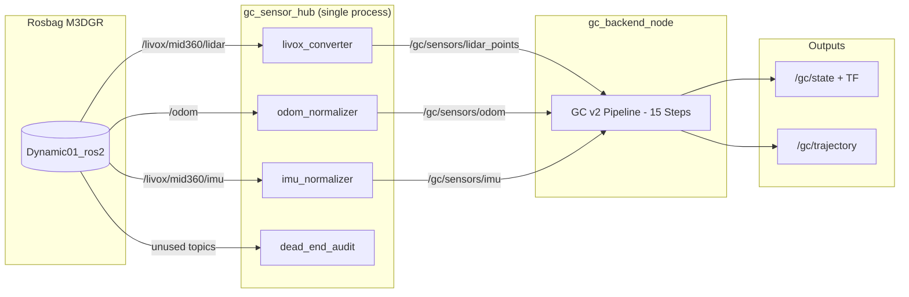

# Frobenius-Legendre SLAM POC (Impact Project v1)

**Compositional inference for dynamic SLAM using information-geometric methods**

---
Embracing uncertainty is a cornerstone of robust robotics and SLAM systems, as pursuing absolute certainty often leads to brittle designs that fail under real-world conflicts and unknowns. Fundamental limits like the Heisenberg uncertainty principle highlight inherent trade-offs in measurement precision, while Gödel's incompleteness theorems remind us that no formal model can be fully complete or self-proving, ensuring "certainty" remains illusory. Instead, wise engineering accepts these realities, building antifragile systems that quantify uncertainty (e.g., via covariances and divergences), detect anomalies, and adapt dynamically—turning potential weaknesses into strengths for resilient performance in noisy, dynamic environments.

In practice, this means layering defenses in SLAM: Use principled tools like Wishart conjugates for adaptive noise modeling, Hellinger bounds for outlier rejection, and Frobenius corrections for handling approximations, allowing systems to thrive amid conflicting data rather than assuming monotonic progress or perfect models.
---

## MVP Status

The current **MVP** implements **Golden Child SLAM v2** — a strict, branch-free, fixed-cost SLAM backend validated on the **M3DGR Dynamic01 rosbag**.

Bag topic inventory + usage map (canonical): `docs/BAG_TOPICS_AND_USAGE.md`.

**Current Architecture (GC v2):**
- **22D augmented state**: pose (6D) + velocity (3D) + gyro bias (3D) + accel bias (3D) + time offset (1D) + LiDAR-IMU extrinsic (6D)
- **LiDAR-only pipeline** (current): 15-step fixed-cost scan processing with UT deskew, soft binning, Wahba rotation, WLS translation
- **Sensor Hub**: Single-process frontend converting raw topics to canonical `/gc/sensors/*` topics
- **No gates/branches**: All operators are total functions with continuous influence scalars

**Target Endstate (in progress):**
- **Inverse-Wishart adaptive noise**: Process and measurement covariances as conjugate IW states with datasheet priors
- **Sensor evidence (IMU + Odom)**: vMF accelerometer + Gaussian gyro + Odom partial observation (x,y,yaw strong; z,roll,pitch weak)
- **Likelihood-based evidence**: Replace UT regression with Laplace/I-projection of explicit likelihood terms

**Policy notes:**
- All noise parameters will be IW random variables (not fixed constants)
- IMU covariances from Livox are zeros (placeholder); using ICM-40609 datasheet specs as weak priors
- Odometry covariances from bag are real 2D-aware values (used as informative priors)

**Evaluation:** `bash tools/run_and_evaluate_gc.sh` (artifacts under `results/gc_*/`)

---

## Quick Start (GC v2)

### Build
```bash
cd fl_ws
source /opt/ros/jazzy/setup.bash
colcon build --packages-select fl_slam_poc
source install/setup.bash
```

### Run GC v2 Pipeline (Primary)
```bash
# Golden Child SLAM v2: full pipeline + metrics + plots
bash tools/run_and_evaluate_gc.sh
```

This runs the M3DGR Dynamic01 rosbag through the GC v2 pipeline and generates evaluation artifacts in `results/gc_YYYYMMDD_HHMMSS/`.

### Run Legacy Pipeline (if needed)
```bash
# Legacy frontend/backend architecture (for comparison)
bash tools/run_and_evaluate.sh
```

Legacy results go to `results/m3dgr_YYYYMMDD_HHMMSS/`.

---

## System Architecture

### Golden Child SLAM v2 Pipeline (Current)

The GC v2 architecture uses a single-process sensor hub and a branch-free 15-step pipeline:



**Topic Naming Convention:**
- Raw topics stay as-is from bag (`/odom`, `/livox/mid360/*`)
- Sensor Hub publishes canonical topics under `/gc/sensors/*`
- Backend subscribes ONLY to `/gc/sensors/*` (never raw topics)

**15-Step Pipeline (per scan, per hypothesis):**
1. PointBudgetResample → 2. PredictDiffusion → 3. DeskewUTMomentMatch → 4. BinSoftAssign → 5. ScanBinMomentMatch → 6. KappaFromResultant → 7. WahbaSVD → 8. TranslationWLS → 9. LidarQuadraticEvidence → 10. FusionScaleFromCertificates → 11. InfoFusionAdditive → 12. PoseUpdateFrobeniusRecompose → 13. PoseCovInflationPushforward → 14. AnchorDriftUpdate → 15. HypothesisBarycenterProjection

**Current status:** LiDAR-only (IMU/odom subscribed but not fused into belief). See `docs/Fusion_issues.md` for details.

### Runtime Flow Diagram (File Structure)

The diagram below mirrors the current file/process layout: the Rosbag feeds the sensor hub, evidence extractors, and backend pipeline before the outputs and diagnostics are published.

```mermaid
flowchart TB
    subgraph BAG[Rosbag: M3DGR]
        bag([Dynamic01_ros2])
    end

    subgraph HUB[gc_sensor_hub (single process)]
        livox[livox_converter]
        imu_norm[imu_normalizer]
        odom_norm[odom_normalizer]
        audit[dead_end_audit]
    end

    subgraph EXTRACT[Evidence Extractors]
        lidarE(LidarEvidenceExtractor)
        imuE(ImuEvidenceExtractor)
        odomE(OdomEvidenceExtractor)
    end

    subgraph CORE[gc_backend_node → Inference Core (15 steps)]
        state[State Mgmt: BeliefGaussianInfo / MapStats / Hypotheses]
        pipeline[Pipeline (1. PointBudgetResample → … → 15. HypothesisBarycenterProjection)]
    end

    subgraph OUT[Output Interface]
        pose[/gc/state + TF/]
        traj[/gc/trajectory/]
        status[/gc/status + /gc/runtime_manifest/]
        cert[/gc/certificate/]
    end

    bag --> livox
    bag --> imu_norm
    bag --> odom_norm
    bag --> audit

    livox --> lidarE
    imu_norm --> imuE
    odom_norm --> odomE

    lidarE --> CORE
    imuE --> CORE
    odomE --> CORE

    CORE --> pose
    CORE --> traj
    CORE --> status
    CORE --> cert
```

### Legacy Architecture (Archived)

The legacy frontend/backend architecture is preserved under `archive/` for reference but is not used by the GC v2 evaluation pipeline.

### Component Summary (GC v2)

**Rosbag Topics (M3DGR):**
- `/odom` - Absolute pose odometry (`nav_msgs/Odometry`)
- `/livox/mid360/lidar` - Livox LiDAR data (`Livox CustomMsg`)
- `/livox/mid360/imu` - Livox IMU data (`sensor_msgs/Imu`)
- Camera topics (RGB/Depth) - Present but not used in GC v2 eval

**Sensor Hub (`gc_sensor_hub`):**
- `livox_converter` - Converts Livox → `/gc/sensors/lidar_points`
- `odom_normalizer` - Normalizes odom → `/gc/sensors/odom`
- `imu_normalizer` - Normalizes IMU → `/gc/sensors/imu`
- `dead_end_audit` - Monitors unused topics for accountability

**Backend Node (`gc_backend_node`):**
- `backend_node.py` - 15-step fixed-cost pipeline orchestration
- `pipeline.py` - Per-scan pipeline implementation
- `operators/` - Individual operator implementations:
  - `predict.py` - PredictDiffusion (process noise)
  - `deskew.py` - DeskewUTMomentMatch (UT sigma-point deskew)
  - `binning.py` - BinSoftAssign + ScanBinMomentMatch
  - `kappa.py` - KappaFromResultant (vMF concentration)
  - `wahba.py` - WahbaSVD (rotation estimation)
  - `translation.py` - TranslationWLS (weighted least squares)
  - `lidar_evidence.py` - LidarQuadraticEvidence (to be replaced)
  - `fusion.py` - InfoFusionAdditive
  - `recompose.py` - PoseUpdateFrobeniusRecompose
- **Publishes:** `/gc/state`, `/gc/trajectory`, `/gc/status`

**Shared Utilities (`common/`):**
- `belief.py` - BeliefGaussianInfo (22D augmented state)
- `certificates.py` - CertBundle, ExpectedEffect
- `geometry/se3_jax.py` - SE(3) JAX operations

---

## Code Structure

### Package Organization

```
fl_ws/src/fl_slam_poc/
├── fl_slam_poc/
│   ├── frontend/              # Sensor processing + frontend orchestration
│   │   ├── frontend_node.py  # Main frontend orchestration
│   │   ├── sensor_io.py       # Sensor I/O, buffering, TF
│   │   ├── anchor_manager.py  # Anchor lifecycle management
│   │   ├── loop_processor.py  # Loop detection via ICP
│   │   ├── descriptor_builder.py  # NIG descriptor extraction
│   │   ├── icp.py             # CPU ICP registration
│   │   ├── pointcloud_gpu.py  # GPU ICP registration
│   │   ├── rgbd_processor.py # RGB-D processing
│   │   ├── vmf_geometry.py    # von Mises-Fisher geometry
│   │   ├── status_monitor.py  # Sensor status monitoring
│   │   ├── odom_bridge.py # Odom bridge (absolute → delta)
│   │   ├── livox_converter.py # Livox → PointCloud2
│   │   └── (C++) image_decompress_cpp # Image decompression (installed binary)
│   │
│   ├── backend/               # State estimation + fusion
│   │   ├── backend_node.py   # Main backend orchestration
│   │   ├── gaussian_info.py   # Gaussian information fusion
│   │   ├── gaussian_geom.py   # Gaussian geometry operations
│   │   ├── imu_jax_kernel.py  # IMU kernels (JAX/GPU)
│   │   ├── lie_jax.py         # Lie algebra (JAX/GPU)
│   │   ├── dirichlet_routing.py # Dirichlet routing
│   │   ├── information_distances.py # Information distances
│   │   ├── nig.py             # Normal-Inverse-Gamma model
│   │   ├── birth.py           # Stochastic birth model
│   │   ├── adaptive.py        # Adaptive parameters
│   │   ├── process_noise.py   # Process noise models
│   │   ├── weights.py         # Evidence weights
│   │   └── timestamp.py       # Timestamp alignment
│   │
│   ├── common/                # Shared utilities (pure Python, no ROS)
│   │   ├── se3.py             # SE(3) operations
│   │   ├── dirichlet_geom.py  # Dirichlet geometry
│   │   ├── op_report.py       # Operation reporting
│   │   └── constants.py       # Constants
│   │
│   └── msg/                   # Custom ROS messages
│       ├── AnchorCreate.msg
│       ├── LoopFactor.msg
│       └── IMUSegment.msg
│
├── launch/
│   └── poc_m3dgr_rosbag.launch.py  # M3DGR rosbag launch file
│
└── test/                      # Unit tests
    ├── test_imu_fusion_contract_b.py
    ├── test_pointcloud_3d.py
    ├── test_rotation_conversions.py
    └── test_audit_invariants.py
```

### Key Design Principles

1. **Modular Separation:** Frontend handles sensor processing, backend handles state estimation
2. **Pure Utilities:** `common/` contains pure Python utilities with no ROS dependencies
3. **Orchestration Pattern:** `*_node.py` files orchestrate, actual math is in helper modules
4. **Information Geometry:** All fusion uses information-geometric operators (Bregman barycenters, Fisher-Rao distances)

---

## Data Flow

### Input Topics (M3DGR Rosbag)
- `/odom` - Absolute pose odometry
- `/livox/mid360/lidar` - Livox LiDAR data
- `/camera/imu` - IMU data

### Preprocessing
1. **Odom Bridge:** `/odom` (absolute) → `/sim/odom` (delta)
2. **Livox Converter:** `/livox/mid360/lidar` → `/lidar/points` (PointCloud2)

### Frontend Processing
1. **Sensor I/O:** Buffers sensor data, manages TF
2. **Anchor Management:** Creates anchors based on birth model
3. **Loop Detection:** ICP registration between current scan and anchor point clouds
4. **IMU Preintegration:** Integrates IMU measurements between keyframes
5. **Publishes:**
   - `/sim/anchor_create` - New anchor events
   - `/sim/loop_factor` - Loop closure constraints
   - `/sim/imu_segment` - IMU preintegrated segments

### Backend Processing
1. **State Estimation:** Maintains sparse anchor modules (6DOF or 15DOF)
2. **Information Fusion:** Gaussian information form fusion (closed-form)
3. **Loop Closure:** One-shot recomposition via Bregman barycenters
4. **IMU Fusion:** Two-pose factor fusion for IMU segments
5. **Publishes:**
   - `/cdwm/state` - Current state estimate
   - `/cdwm/trajectory` - Trajectory path
   - `/cdwm/map` - Point cloud map

---

## Validation & Evaluation

FL-SLAM includes publication-quality validation against ground truth using standard SLAM metrics.

### Run with Evaluation

```bash
# Full pipeline: SLAM + metrics + plots
bash tools/run_and_evaluate.sh
```

This computes:
- **ATE (Absolute Trajectory Error)**: Global consistency (translation + rotation)
- **RPE (Relative Pose Error)**: Local drift at multiple scales (1m, 5m, 10m)
- **Trajectory Validation**: Checks for timestamp issues and coordinate ranges
- **Publication-Quality Plots**: 4-view trajectory, error heatmap, pose graph

### Output Files

Results are saved to `results/m3dgr_YYYYMMDD_HHMMSS/` with:

**Trajectory Plots:**
- `trajectory_comparison.png` - 4-view overlay (XY, XZ, YZ, 3D)
- `trajectory_heatmap.png` - Trajectory colored by error magnitude
- `pose_graph.png` - Pose nodes with odometry edges

**Error Analysis:**
- `error_analysis.png` - Error over time + histogram distribution

**Metrics:**
- `metrics.txt` - Human-readable summary (ATE/RPE translation + rotation)
- `metrics.csv` - Spreadsheet-ready with all statistics

**Trajectories:**
- `estimated_trajectory.tum` - SLAM output in TUM format
- `ground_truth_aligned.tum` - Aligned ground truth

### Expected Performance (M3DGR Dynamic01)

Based on system design:
- **ATE Translation RMSE**: Target < 5m (outdoor dynamic sequence)
- **ATE Rotation RMSE**: Target < 5 deg
- **RPE @ 1m**: Target < 0.1 m/m (10% local drift)
- **Loop closures**: Detected via ICP + NIG descriptors
- **Map consistency**: Verified via anchor point clouds

See [`docs/EVALUATION.md`](docs/EVALUATION.md) for detailed evaluation guide.

---

## Architecture Principles

### Core Principles (Non-Negotiable)
1. **P1**: Closed-form-first exactness
2. **P2**: Associative, order-robust fusion
3. **P3**: Legendre/Bregman foundations
4. **P4**: Frobenius third-order correction for approximations
5. **P5**: Soft association (no heuristic gating)
6. **P6**: One-shot loop correction by recomposition
7. **P7**: Local modularity

### Information Geometry Foundation
- **Exponential families** with Legendre duality
- **Bregman barycenters** for fusion
- **Fisher-Rao metric** for soft association
- **Frobenius structure** for third-order corrections

### Representations
- **SE(3)**: Rotation vectors (axis-angle) in `so(3)` tangent space
- **Covariance**: Tangent space at identity `[δx, δy, δz, δωx, δωy, δωz]`
- **Transport**: Via Adjoint representation (exact)

### Operations
- **NIG descriptors**: Normal-Inverse-Gamma model for probabilistic descriptors
- **Stochastic birth**: Poisson model with intensity λ = λ₀ * r_new
- **ICP**: Point cloud registration for loop factors
- **Frobenius correction**: Third-order retraction for linearization
- **IMU preintegration**: Forster et al. (2017) style preintegration with Frobenius correction

---

## Key Topics (GC v2)

### Raw Topics (from M3DGR Rosbag)
- `/odom` - Absolute pose odometry (`nav_msgs/Odometry`)
- `/livox/mid360/lidar` - Livox LiDAR data (`livox_ros_driver2/CustomMsg`)
- `/livox/mid360/imu` - Livox IMU data (`sensor_msgs/Imu`)

### Canonical Topics (Sensor Hub → Backend)
- `/gc/sensors/lidar_points` - PointCloud2 (from Livox converter)
- `/gc/sensors/odom` - Normalized odometry
- `/gc/sensors/imu` - Normalized IMU

### Output Topics (GC Backend)
- `/gc/state` - Estimated state (`nav_msgs/Odometry`) + TF
- `/gc/trajectory` - Trajectory path (`nav_msgs/Path`)
- `/gc/runtime_manifest` - Operator/sensor configuration (JSON)
- `/gc/status` - Backend status and diagnostics

### Dead-End Audit Topics (monitored but not fused)
- `/camera/imu`, `/camera/color/image_raw/compressed`, etc. (see `gc_dead_end_audit.yaml`)
- `/cdwm/op_report` - Operation reports (JSON)
- `/cdwm/frontend_status` - Frontend sensor status (JSON)
- `/cdwm/backend_status` - Backend mode and diagnostics (JSON)

---

## Dependencies

### System
- ROS 2 Jazzy
- Python 3.10+
- NumPy, SciPy
- JAX (for GPU-accelerated IMU/Lie algebra operations)

### Optional
- CUDA (for GPU acceleration)
- Gazebo (for simulation, see `phase2/`)

### Install
```bash
pip install -r requirements.txt
```

---

## Testing

See **[docs/TESTING.md](docs/TESTING.md)** for complete testing documentation.

### MVP Validation (M3DGR)
```bash
bash tools/run_and_evaluate.sh
```

Runs the full M3DGR rosbag pipeline and produces metrics/plots under `results/`.

### Integration Tests
```bash
# MVP integration test
./tools/test-integration.sh
```

### Unit Tests
```bash
cd fl_ws
source install/setup.bash
pytest src/fl_slam_poc/test/
```

---

## Documentation

### Essential (Start Here)
- **[ROADMAP.md](ROADMAP.md)** - Current priorities and planned work (MVP status, algorithm fixes, future features)
- **[AGENTS.md](AGENTS.md)** - Design invariants and rules (P1-P7)
- **[CHANGELOG.md](CHANGELOG.md)** - Project history and decisions

### MVP Workflow
- **[docs/EVALUATION.md](docs/EVALUATION.md)** - Evaluation metrics and plots
- **[docs/ROSBAG.md](docs/ROSBAG.md)** - Rosbag testing workflow
- **[docs/TESTING.md](docs/TESTING.md)** - Testing framework and workflows
- **[docs/INSTALLATION.md](docs/INSTALLATION.md)** - Installation and setup guide

### Reference
- **[docs/Comprehensive Information Geometry.md](docs/Comprehensive Information Geometry.md)** - Mathematical formulas
- **[docs/Project_Implimentation_Guide.sty](docs/Project_Implimentation_Guide.sty)** - Formal specification
- **[docs/MAP_VISUALIZATION.md](docs/MAP_VISUALIZATION.md)** - Visualization guide
- **[docs/ORDER_INVARIANCE.md](docs/ORDER_INVARIANCE.md)** - Order invariance documentation
- **[docs/POC_Testing_Status.md](docs/POC_Testing_Status.md)** - Current testing state

---

## References

### Information Geometry
- Amari & Nagaoka (2000): *Methods of Information Geometry*
- Amari (2016): *Information Geometry and Its Applications*
- Combe (2022-2025): Frobenius statistical manifolds, quantum geometry, hexagonal webs

### Robotics
- Barfoot (2017): *State Estimation for Robotics*
- Miyamoto et al. (2024): Closed-form information distances
- Forster et al. (2017): "On-Manifold Preintegration for Real-Time Visual-Inertial Odometry" (TRO)

---

## Contact

**William Habacivch**  
Email: whab13@mit.edu
