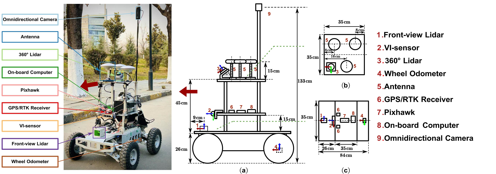

# Frobenius-Legendre SLAM POC (Impact Project v1)

**Compositional inference for dynamic SLAM using information‑geometric methods.**

Embracing uncertainty is a cornerstone of robust robotics and SLAM: we use principled tools (Inverse‑Wishart adaptive noise, Frobenius corrections for approximations, information‑form fusion) so the system can adapt amid conflicting data rather than assuming perfect models.

---

## Overview

**Golden Child SLAM v2** is a **strict, branch‑free, fixed‑cost** backend designed for auditability and robustness. The pipeline builds **explicit likelihood‑based evidence** (vMF/Matrix Fisher + Gaussians), fuses in information form, and applies **self‑adaptive noise** at every scan — no gates, no hidden iteration.

### Novelty / Why This Is Different

- **Information‑geometric operators** with **certificates** and **Frobenius corrections** when approximations are triggered.
- **Adaptive noise everywhere** via Inverse‑Wishart conjugacy — no fixed noise constants in the loop.
- **Branch‑free** fixed‑cost pipeline per scan: same math path every time.
- **Matrix Fisher rotation evidence** (scan‑to‑map) + **planarized translation** with self‑adaptive z precision.
- **Auditable runtime manifest** enumerating all enabled operators and backends (no hidden fallbacks).

### Goals

- **Robust SLAM in dynamic environments** without fragile heuristics or gating.
- **Traceable, reproducible behavior** (single‑path execution, fixed cost, explicit evidence).
- **Self‑adaptation** to changing noise and sensor reliability.

---

## Visuals




---

## Status

The **primary implementation** is **Golden Child SLAM v2** — a strict, branch-free, fixed-cost SLAM backend validated on the **M3DGR Dynamic01** rosbag.

- **22D augmented state:** pose (6D) + velocity (3D) + gyro bias (3D) + accel bias (3D) + time offset (1D) + LiDAR–IMU extrinsic (6D)
- **Sensors fused:** LiDAR (Matrix Fisher rotation + planar translation evidence), IMU (time-resolved vMF tilt + gyro rotation + preintegration factor), odometry (pose + twist with kinematic consistency)
- **Adaptive noise:** Inverse-Wishart for process Q and measurement Σ (gyro, accel, LiDAR); updates every scan (no gates)
- **14-step pipeline per scan:** PointBudgetResample → PredictDiffusion → DeskewConstantTwist → BinSoftAssign → ScanBinMomentMatch → MatrixFisherRotation → PlanarTranslationEvidence → Evidence (odom pose + odom twist + planar priors + IMU + LiDAR) → FusionScaleFromCertificates → InfoFusionAdditive → PoseUpdateFrobeniusRecompose → PoseCovInflationPushforward → AnchorDriftUpdate
- **Canonical topic/bag reference:** `docs/BAG_TOPICS_AND_USAGE.md`

**Known limitations** (see `docs/PIPELINE_DESIGN_GAPS.md`): cross-sensor consistency likelihoods are still diagnostics (gyro↔odom↔LiDAR yaw); IMU message covariances and LiDAR intensity are not consumed; nonlinear evidence still uses local quadraticization (vMF/MF → Gaussian info). Pipeline trace and causality: `docs/PIPELINE_TRACE_SINGLE_DOC.md`.

---

## Quick Start

### Build

```bash
cd fl_ws
source /opt/ros/jazzy/setup.bash
colcon build --packages-select fl_slam_poc
source install/setup.bash
```

### Run GC v2 (primary evaluation)

```bash
# Full pipeline: SLAM + alignment + metrics + plots + audit tests
bash tools/run_and_evaluate_gc.sh
```

Uses the M3DGR Dynamic01 rosbag; artifacts go to `results/gc_YYYYMMDD_HHMMSS/` (trajectory, metrics, diagnostics, wiring summary, dashboard).

### Legacy pipeline (optional)

```bash
bash tools/run_and_evaluate.sh
```

Results under `results/m3dgr_YYYYMMDD_HHMMSS/`.

---

## System Architecture

**GC v2** uses a single-process sensor hub and the backend node; the backend subscribes only to canonical `/gc/sensors/*` topics.

```
Rosbag (M3DGR)  →  gc_sensor_hub  →  gc_backend_node  →  /gc/state, /gc/trajectory, TF
                     livox_converter    (14-step pipeline
                     odom_normalizer     + IW updates
                     imu_normalizer      + hypothesis combine)
                     dead_end_audit
```

- **Raw topics (from bag):** `/odom`, `/livox/mid360/lidar`, `/livox/mid360/imu`
- **Canonical (hub → backend):** `/gc/sensors/lidar_points`, `/gc/sensors/odom`, `/gc/sensors/imu`
- **Outputs:** `/gc/state`, `/gc/trajectory`, `/gc/status`, `/gc/runtime_manifest`, TF

**14-step pipeline (per scan, per hypothesis):**

1. PointBudgetResample  
2. PredictDiffusion (OU-style, uses adaptive Q)  
3. DeskewConstantTwist (IMU preintegration over scan window)  
4. BinSoftAssign  
5. ScanBinMomentMatch  
6. KappaFromResultant (inside ScanBinMomentMatch)  
7. MatrixFisherRotation (rotation)  
8. PlanarTranslationEvidence (translation with self-adaptive z precision)  
9. Evidence: odom pose + odom twist + planar priors + IMU (time-resolved vMF + gyro + preint) + LiDAR (Matrix Fisher + planar translation)  
10. FusionScaleFromCertificates  
11. InfoFusionAdditive  
12. PoseUpdateFrobeniusRecompose  
13. PoseCovInflationPushforward (map update)  
14. AnchorDriftUpdate  

IW sufficient-statistics accumulation and hypothesis combine run after the pipeline in the backend node.

---

## Code Layout

```
fl_ws/src/fl_slam_poc/
├── fl_slam_poc/
│   ├── frontend/
│   │   ├── hub/gc_sensor_hub.py      # Single process: converter + normalizers
│   │   ├── sensors/
│   │   │   ├── livox_converter.py
│   │   │   ├── imu_normalizer.py
│   │   │   └── odom_normalizer.py
│   │   └── audit/
│   │       ├── dead_end_audit_node.py
│   │       └── wiring_auditor.py
│   ├── backend/
│   │   ├── backend_node.py            # Orchestration, IW state, hypothesis combine
│   │   ├── pipeline.py                # process_scan_single_hypothesis (14 steps)
│   │   ├── operators/
│   │   │   ├── point_budget.py
│   │   │   ├── predict.py
│   │   │   ├── deskew_constant_twist.py
│   │   │   ├── imu_preintegration.py
│   │   │   ├── binning.py
│   │   │   ├── odom_evidence.py
│   │   │   ├── odom_twist_evidence.py
│   │   │   ├── imu_evidence.py, imu_gyro_evidence.py, imu_preintegration_factor.py
│   │   │   ├── matrix_fisher_evidence.py
│   │   │   ├── planar_prior.py
│   │   │   ├── fusion.py
│   │   │   ├── recompose.py
│   │   │   ├── map_update.py
│   │   │   ├── anchor_drift.py
│   │   │   ├── inverse_wishart_jax.py, measurement_noise_iw_jax.py, lidar_bucket_noise_iw_jax.py
│   │   │   └── ...
│   │   └── structures/
│   │       ├── bin_atlas.py
│   │       ├── inverse_wishart_jax.py
│   │       ├── measurement_noise_iw_jax.py
│   │       └── lidar_bucket_noise_iw_jax.py
│   └── common/
│       ├── belief.py                  # BeliefGaussianInfo (22D information form)
│       ├── certificates.py
│       ├── constants.py
│       ├── geometry/se3_jax.py
│       ├── jax_init.py
│       └── primitives.py
├── launch/gc_rosbag.launch.py
├── config/gc_unified.yaml
└── test/
```

---

## Validation & Evaluation

**Primary:** `bash tools/run_and_evaluate_gc.sh`

- Runs SLAM on M3DGR Dynamic01, aligns estimated trajectory to ground truth, computes ATE/RPE and per-axis errors, runs audit-invariant tests, and (if diagnostics are exported) builds a diagnostics dashboard.
- Outputs: `results/gc_YYYYMMDD_HHMMSS/` — `metrics.txt`, `metrics.csv`, trajectory plots, `estimated_trajectory.tum`, `ground_truth_aligned.tum`, `diagnostics.npz`, `wiring_summary.json`, `audit_invariants.log`.

Performance is under active iteration; see `docs/PIPELINE_DESIGN_GAPS.md` for current gaps and `docs/PIPELINE_TRACE_SINGLE_DOC.md` for a full trace. The z‑drift mechanism documented in `docs/TRACE_Z_EVIDENCE_AND_TRAJECTORY.md` is legacy and now mitigated by planar translation/priors/map‑z fix.

---

## Docs to Start With

- **Pipeline & dataflow:** `docs/IMU_BELIEF_MAP_AND_FUSION.md`
- **Design gaps / roadmap:** `docs/PIPELINE_DESIGN_GAPS.md`
- **Trace (single scan):** `docs/PIPELINE_TRACE_SINGLE_DOC.md`
- **Frame conventions:** `docs/FRAME_AND_QUATERNION_CONVENTIONS.md`

---

## Documentation

| Doc | Description |
|-----|-------------|
| **[AGENTS.md](AGENTS.md)** | Project invariants, quickstart, canonical references |
| **[CHANGELOG.md](CHANGELOG.md)** | History and design decisions |
| **[ROADMAP.md](ROADMAP.md)** | Priorities and planned work |
| **docs/BAG_TOPICS_AND_USAGE.md** | Bag topics and pipeline usage (canonical) |
| **docs/PIPELINE_TRACE_SINGLE_DOC.md** | Single pipeline trace: value-as-object, spine, IMU/odom/LiDAR, belief/IW, z/performance |
| **docs/GOLDEN_CHILD_INTERFACE_SPEC.md** | GC v2 interface and operator contracts |
| **docs/IMU_BELIEF_MAP_AND_FUSION.md** | Pipeline reference: topics, steps, evidence, fusion |
| **docs/FRAME_AND_QUATERNION_CONVENTIONS.md** | Frames, quaternions, SE(3) |
| **docs/PIPELINE_DESIGN_GAPS.md** | Known limitations (cross-sensor consistency, unused covariances, nonlinear approximations) |
| **docs/TRACE_Z_EVIDENCE_AND_TRAJECTORY.md** | Where z in pose/trajectory comes from |
| **docs/PREINTEGRATION_STEP_BY_STEP.md** | IMU preintegration steps (including gravity) |
| **docs/EVALUATION.md** | Evaluation metrics and workflow |
| **docs/TESTING.md** | Testing framework |
| **tools/DIAGNOSTIC_TOOLS.md** | Diagnostic and inspection tools |

---

## Dependencies

- ROS 2 Jazzy  
- Python 3.10+  
- NumPy, SciPy  
- JAX (GPU recommended for IMU/Lie ops)  
- evo, matplotlib (for evaluation)

```bash
pip install -r requirements.txt
```

---

## References

- Amari & Nagaoka (2000): *Methods of Information Geometry*
- Barfoot (2017): *State Estimation for Robotics*
- Forster et al. (2017): "On-Manifold Preintegration for Real-Time Visual-Inertial Odometry" (TRO)

---

## Outputs & Artifacts

Run outputs go to `results/gc_YYYYMMDD_HHMMSS/` and include:
- `trajectory.tum` (estimate)
- `metrics.json` (ATE/RPE)
- `diagnostics.npz` (per‑scan evidence and sentinels)
- `dashboard.html` (Plotly summary)

---

## Contact

**William Habacivch**  
Email: whab13@mit.edu
