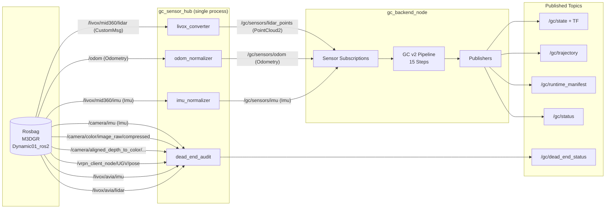

# Fusion Issues (GC v2) — Code/Spec Consistency Notes

This doc is a **code-level sanity check** of whether GC v2 currently fuses **LiDAR + IMU + odom**, and where it diverges from the intent in `docs/GOLDEN_CHILD_INTERFACE_SPEC.md`.

## TL;DR (current working tree)

- **Updated (Jan 2026):** GC v2 now fuses **all three sensor modalities**: LiDAR + IMU + Odom.
- **Correct:** The SLAM update path is `on_lidar → process_scan_single_hypothesis → process_hypotheses`.
- **Correct:** Scan bounds are derived from per-point timestamps (and always include the header stamp).
- **Implemented:** IMU is used for:
  - Deskew via constant-twist IMU preintegration (`DeskewConstantTwist`)
  - Gravity direction evidence (`ImuVMFGravityEvidence`)
  - Rotation evidence (`ImuGyroRotationEvidence`)
- **Implemented:** Odom is fused via `OdomQuadraticEvidence` (Gaussian SE(3) pose factor).

## 1) Launch wiring (what runs in GC rosbag eval)

The GC rosbag launcher starts:

- `gc_backend_node` (GC backend)
- `gc_sensor_hub` (single-process Sensor I/O hub: converter + normalizers + dead-end audit)
- `wiring_auditor` (end-of-run wiring summary)

See `fl_ws/src/fl_slam_poc/launch/gc_rosbag.launch.py`.

### 1.1 Target runtime graph (implemented)

The GC rosbag launcher now implements the following architecture with canonical `/gc/sensors/*` topics:

**Topic Naming Convention:**

| Source | Raw Topic (from bag) | Canonical Topic (for backend) |
|--------|---------------------|------------------------------|
| LiDAR | `/livox/mid360/lidar` | `/gc/sensors/lidar_points` |
| Odometry | `/odom` | `/gc/sensors/odom` |
| IMU | `/livox/mid360/imu` | `/gc/sensors/imu` |

**Rule:** Backend subscribes ONLY to `/gc/sensors/*` - never to raw topics. This makes it impossible to accidentally fuse raw data while thinking it's normalized.

## 2) Backend subscriptions vs what’s used downstream

### 2.1 Subscriptions exist (LiDAR + odom + IMU)

`GoldenChildBackend` subscribes to canonical `/gc/sensors/*` topics:

- LiDAR `PointCloud2` on `/gc/sensors/lidar_points`
- odom `nav_msgs/Odometry` on `/gc/sensors/odom`
- IMU `sensor_msgs/Imu` on `/gc/sensors/imu`

See `fl_ws/src/fl_slam_poc/fl_slam_poc/backend/backend_node.py`.

### 2.2 IMU is buffered AND fused

`on_imu()` appends `(stamp, gyro, accel)` into `self.imu_buffer`, and bounds it by `self.max_imu_buffer`.

**Updated (Jan 2026):** IMU data IS now consumed by the pipeline:

- `on_lidar()` extracts IMU arrays and passes them to `process_scan_single_hypothesis()`
- IMU is used for deskew via `DeskewConstantTwist` (IMU preintegration)
- IMU produces evidence via `ImuVMFGravityEvidence` and `ImuGyroRotationEvidence`
- Evidence is fused: `L_evidence = L_lidar + L_odom + L_imu + L_gyro`

### 2.3 Odom is stored AND fused

`on_odom()` stores an SE(3) pose in `self.last_odom_pose` and covariance in `self.last_odom_cov_se3`.

**Updated (Jan 2026):** Odom data IS now consumed by the pipeline:

- `on_lidar()` passes odom pose and covariance to `process_scan_single_hypothesis()`
- Odom produces evidence via `OdomQuadraticEvidence` (Gaussian SE(3) pose factor)
- Evidence is fused: `L_evidence = L_lidar + L_odom + L_imu + L_gyro`

## 3) Where SLAM actually happens (LiDAR pipeline)

The SLAM update happens in `on_lidar()` and calls:

- `process_scan_single_hypothesis(...)` for each hypothesis
- `process_hypotheses(...)` to combine hypotheses

See `fl_ws/src/fl_slam_poc/fl_slam_poc/backend/backend_node.py:343`.

The per-scan pipeline is the fixed 15-step sequence described in:

- `fl_ws/src/fl_slam_poc/fl_slam_poc/backend/pipeline.py:135`

**Inputs used by the pipeline (Updated Jan 2026)**

- LiDAR points/timestamps/weights (from `PointCloud2`)
- IMU samples from `/gc/sensors/imu` (for deskew + evidence)
- Odometry pose/covariance from `/gc/sensors/odom` (for evidence)
- `dt_sec` derived from scan timing
- internal state/config (`Q`, `bin_atlas`, `map_stats`, `belief_prev`, constants)

## 4) Spec intent vs current implementation (important clarification)

### 4.1 IMU in the spec

The spec allocates IMU-related state (velocity, biases, time offset, LiDAR–IMU extrinsics) and includes the statement:

- `docs/GOLDEN_CHILD_INTERFACE_SPEC.md:754` (“IMU uncertainty enters deskew UT … and therefore the quadratic evidence.”)

**Clarification:** the spec statement is about **mathematical influence**, not “must subscribe to a ROS IMU topic”. In the current implementation:

- `DeskewUTMomentMatch` draws sigma points from the **belief covariance** (`belief_pred.to_moments(...)`) and transforms points accordingly.
- But since there is no operator that ingests IMU measurements, the belief covariance is driven by `PredictDiffusion` (process noise) rather than by IMU data.

So the IMU *hook* exists in the state layout, but **IMU measurements are not yet flowing into belief/covariance**, meaning the spec’s intended IMU coupling is not realized end-to-end yet.

### 4.2 Odom in the spec

The strict interface spec does not define an odometry operator, and does not prescribe ROS schemas (it explicitly scopes itself to internal operator contracts).

**Implication:** if `/odom` is used as evidence, it must be introduced as a declared operator/evidence family in the GC pipeline (with certificates, explicit approximations, and no fallback/multipath).

## 5) Notes that impact “fusion correctness” even before IMU/odom are wired

- **Scan timing:** scan start/end are derived from per-point timestamps (when present) and the message header stamp; this removes implicit “magic” scan durations.
- **Pose ordering:** GC tangent ordering now matches `se3_jax` (`[trans, rot]`), so SE(3) group ops no longer require permutation. Conversion helpers are identity and kept only for compatibility.

## 6) What this doc does NOT claim

- This doc does **not** claim the LiDAR-only pipeline is “correct SLAM” yet.
- It only claims that **IMU and odom are not fused into the belief** in the current GC v2 runtime, despite being subscribed.

## 7) Evaluation pipeline infrastructure (what’s already built)

The GC eval script is `tools/run_and_evaluate_gc.sh`. At a high level it:

- does **preflight** (venv exists, JAX import works, **GPU required**, eval deps present)
- builds `fl_slam_poc` via `colcon build`
- launches `fl_slam_poc gc_rosbag.launch.py` against `rosbags/m3dgr/Dynamic01_ros2`
- exports the estimated trajectory to `/tmp/gc_slam_trajectory.tum`
- runs offline evaluation and writes a results bundle under `results/gc_YYYYMMDD_HHMMSS/`

Example artifacts (from a recent run directory) include:

- `estimated_trajectory.tum` (copy of the exported estimate)
- `ground_truth_aligned.tum` (GT aligned for evo evaluation)
- `metrics.txt`, `metrics.csv` (ATE/RPE summaries)
- `trajectory_comparison.png`, `trajectory_heatmap.png`, `pose_graph.png`, `error_analysis.png`
- `op_report.jsonl` (structured op/audit events used by the eval tooling)

This matters for fusion debugging because it gives you a repeatable way to detect “nothing changed” vs “wiring changed” in a regression-friendly way.

## 8) Rosbag topics available but not subscribed by GC eval (and other dead ends)

### 8.1 Bag topics present but unused by GC eval

For the M3DGR Dynamic01 bag, `docs/BAG_TOPICS_AND_USAGE.md` documents additional topics that exist but are not part of the GC eval wiring:

- `/camera/imu` (`sensor_msgs/Imu`) — present in bag; GC backend does not subscribe
- `/camera/color/image_raw/compressed` (`sensor_msgs/CompressedImage`) — present in bag; GC backend does not subscribe
- `/camera/aligned_depth_to_color/image_raw/compressedDepth` (`sensor_msgs/CompressedImage`) — present in bag; GC backend does not subscribe
- `/vrpn_client_node/UGV/pose` (`geometry_msgs/PoseStamped`) — ground truth for evaluation only; must never be fused
- `/livox/avia/lidar` (`livox_ros_driver/msg/CustomMsg`) — present in some bags; not used (and may not decode without `livox_ros_driver`)
- `/livox/avia/imu` (`sensor_msgs/Imu`) — present in some bags; not used

**Update:** GC now launches `gc_dead_end_audit_node` (configured by `fl_ws/src/fl_slam_poc/config/gc_dead_end_audit.yaml`) to subscribe to these unused topics for accountability and future expansion planning. The audit node **must never feed the SLAM math**, and it can be configured to **fail-fast** if required topics do not appear within the declared timeout.

### 8.2 Nodes/scripts/config that are “dead ends” for GC eval

These exist in the repo but are not in the GC eval runtime graph:

- `fl_ws/src/fl_slam_poc/scripts/odom_bridge` / `fl_ws/src/fl_slam_poc/fl_slam_poc/frontend/sensors/odom_bridge.py` — not launched by `gc_rosbag.launch.py`
- `fl_ws/src/fl_slam_poc/config/gc_backend.yaml` — contains a `gc_backend` + `livox_converter` parameter block, but `gc_rosbag.launch.py` passes parameters inline and does not load this YAML

### 8.3 Publishers/subsystems that currently go nowhere in GC backend

In `GoldenChildBackend` the following publisher exists but is not (currently) published to:

- `/gc/certificate` (`self.pub_cert`) — declared but unused in the node’s logic

This is useful to track because once IMU/odom are wired, publishing per-scan or per-operator certificates here is an obvious “plumbing completeness” signal.

## 9) Strictness hazards to keep in mind when wiring fusion

Even before introducing IMU/odom evidence, a few “strictness” checks are worth keeping visible:

- **Spec-required runtime manifest fields:** the strict spec includes a `backends` map in the manifest; GC now publishes a small explicit `backends` map via `RuntimeManifest`, but it should be kept up-to-date as new operators/sensor backends are introduced.
- **Converter message type selection:** `livox_converter` is implemented as explicit message-type selection (no “auto” fallback) via the `input_msg_type` parameter; make sure any launch/config keeps this explicit to avoid hidden multipaths.
