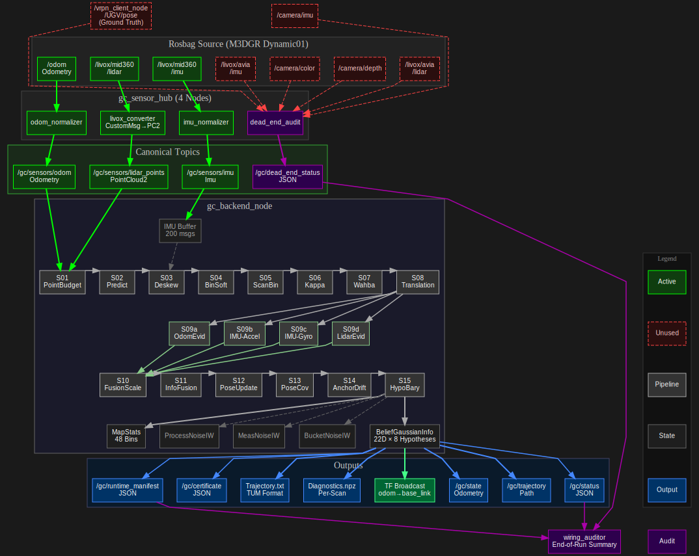

# Golden Child SLAM v2 - Complete System Dataflow Diagram

This document provides a comprehensive Mermaid diagram showing the complete dataflow of the Golden Child SLAM v2 system, including all nodes, topics, and dead-ended items.

## Exporting the Diagram

**Note**: The diagram is generated using **Graphviz** and rendered as **vector graphics (SVG)**. SVG scales infinitely without quality loss!

### Regenerating the Diagram

The diagram source is in `system_dataflow.dot`. To regenerate:

#### Export as SVG (Recommended)
```bash
cd docs
dot -Tsvg system_dataflow.dot -o system_dataflow.svg
```

#### Export as PNG (High Resolution)
```bash
cd docs
dot -Tpng system_dataflow.dot -o system_dataflow.png -Gdpi=300
```

#### Export as PDF
```bash
cd docs
dot -Tpdf system_dataflow.dot -o system_dataflow.pdf
```

### Editing the Diagram

Edit `system_dataflow.dot` with any text editor. The Graphviz DOT format is:
- **Text-based** - easy to version control
- **Deterministic** - same input always produces same output
- **Reliable** - explicit rank constraints ensure correct vertical stacking

After editing, regenerate the SVG using the commands above.

## Complete System Dataflow

The diagram below is embedded directly for preview. You can also view the standalone SVG file: [system_dataflow.svg](system_dataflow.svg)

<div align="center">



</div>

**Source:** The diagram is generated from `system_dataflow.dot` using Graphviz. To regenerate:
```bash
cd docs && dot -Tsvg system_dataflow.dot -o system_dataflow.svg
```

**Note:** If the diagram doesn't render in your markdown preview, you can:
- Open `docs/system_dataflow.svg` directly in your browser
- View the PNG version: `docs/system_dataflow.png`

## Topic Flow Details

### Processed Topics (Active Pipeline)

1. **`/odom`** → `odom_normalizer` → **`/gc/sensors/odom`** → Backend
   - Status: ✅ **FUSED via `OdomQuadraticEvidence` + twist factors** (pose + velocity + yaw-rate + pose–twist consistency)
   - Message: `nav_msgs/Odometry` (absolute → normalized)
   - Frame: `odom_combined` → `base_footprint`

2. **`/livox/mid360/lidar`** → `livox_converter` → **`/gc/sensors/lidar_points`** → Backend
   - Status: ✅ **FUSED via Matrix Fisher rotation + planar translation evidence** (14-step pipeline)
   - Message: `livox_ros_driver2/CustomMsg` → `sensor_msgs/PointCloud2`
   - Frame: `livox_frame`

3. **`/livox/mid360/imu`** → `imu_normalizer` → **`/gc/sensors/imu`** → Backend
   - Status: ✅ **FUSED via `ImuVMFGravityEvidenceTimeResolved` + `ImuGyroRotationEvidence` + `imu_preintegration_factor`**
   - Used for: Deskew (IMU preintegration), gravity direction evidence, gyro rotation evidence, preintegration (velocity/position) evidence
   - Message: `sensor_msgs/Imu`
   - Frame: `livox_frame`

### Dead-End Topics (Tracked but Not Processed)

These topics are present in the rosbag but are **explicitly not consumed** by the GC v2 pipeline. They are tracked by the `dead_end_audit` node for accountability:

1. **`/camera/imu`** - `sensor_msgs/Imu`
   - Reason: Camera IMU not used (using Livox IMU instead)

2. **`/camera/color/image_raw/compressed`** - `sensor_msgs/CompressedImage`
   - Reason: RGB-D processing not enabled in current pipeline

3. **`/camera/aligned_depth_to_color/image_raw/compressedDepth`** - `sensor_msgs/CompressedImage`
   - Reason: RGB-D processing not enabled in current pipeline

4. **`/vrpn_client_node/UGV/pose`** - `geometry_msgs/PoseStamped`
   - Reason: **Ground truth** - must never be fused into inference (evaluation only)

5. **`/livox/avia/lidar`** - `livox_ros_driver/CustomMsg`
   - Reason: Secondary LiDAR not used (using MID-360 only)

6. **`/livox/avia/imu`** - `sensor_msgs/Imu`
   - Reason: Secondary IMU not used (using MID-360 IMU only)

### Output Topics

1. **`/gc/state`** - `nav_msgs/Odometry`
   - Posterior pose estimate with 6×6 covariance
   - Frame: `header.frame_id` = odom_frame (param default `"odom"`), `child_frame_id` = base_frame (param default `"base_link"`)

2. **`/gc/trajectory`** - `nav_msgs/Path`
   - Trajectory path built from state estimates

3. **`/gc/status`** - `std_msgs/String` (JSON)
   - Runtime status: odom_count, scan_count, imu_count, pipeline_runs, map_bins_active

4. **`/gc/runtime_manifest`** - `std_msgs/String` (JSON)
   - System configuration: enabled sensors, backends, operators, topic mappings

5. **`/gc/dead_end_status`** - `std_msgs/String` (JSON)
   - Dead-end topic counts and timestamps

6. **`/tf`** - TF frames
   - Published by backend: `odom_frame` → `base_link`

7. **Trajectory File** (TUM format)
   - Exported to disk for evaluation (`tools/evaluate_slam.py`)

## Node Responsibilities

### gc_sensor_hub (Single Process)
- **livox_converter**: Converts Livox CustomMsg to PointCloud2
- **odom_normalizer**: Normalizes odometry messages
- **imu_normalizer**: Normalizes IMU messages
- **dead_end_audit**: Tracks unused topics for accountability

### gc_backend_node
- Subscribes **ONLY** to canonical topics (`/gc/sensors/*`)
- Runs 14-step fixed-cost pipeline per scan (LiDAR-triggered; IMU and odom consumed per scan)
- Manages state: BeliefGaussianInfo, MapStats, Hypotheses
- Publishes state, trajectory, status, and runtime manifest

### wiring_auditor
- Subscribes to `/gc/status`, `/gc/dead_end_status`, `/gc/runtime_manifest`
- Produces consolidated end-of-run summary
- Writes JSON summary for evaluation script integration

## Current Status Notes

✅ **All three sensor modalities are FUSED** into the belief state:

- **LiDAR**: Matrix Fisher rotation + planar translation evidence (closed‑form pose information)
- **IMU**: `ImuVMFGravityEvidenceTimeResolved` (vMF Laplace on rotation) + `ImuGyroRotationEvidence` (Gaussian SO(3))
- **Odom**: `OdomQuadraticEvidence` (Gaussian SE(3) pose factor)

The evidence terms are combined additively: `L_evidence = L_lidar + L_odom + L_imu + L_gyro + L_imu_preint + L_planar + L_vel + L_wz + L_consistency` (and same for h).

✅ **Dead-end topics are explicitly tracked** for accountability - no data is silently ignored.

## Configuration

Dead-end topics are configured in:
- `fl_ws/src/fl_slam_poc/config/gc_dead_end_audit.yaml`

Canonical topic mappings are configured in:
- `fl_ws/src/fl_slam_poc/config/gc_unified.yaml`

## References

- **Topic usage**: `docs/BAG_TOPICS_AND_USAGE.md`
- **Pipeline reference** (raw topics → frontend → backend → fusion): `docs/IMU_BELIEF_MAP_AND_FUSION.md`
- **Sigma_g and fusion**: `docs/SIGMA_G_AND_FUSION_EXPLAINED.md`
- **Wiring audit**: wiring auditor produces end-of-run summary (see launch)
- **Fusion status**: All sensors (LiDAR + IMU + Odom) are fused; evidence sum includes L_imu_preint.
- **Golden Child spec**: `docs/GOLDEN_CHILD_INTERFACE_SPEC.md`
